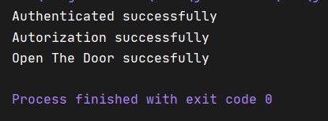

# Mollapp
MollApp FP Dual DAW Project, This Project is about to build a System that consists of Once a user registers in the system, the company provides a mobile application called mollapp that allows access to the cars that the company and the users park in various places in Palma.

When a person wants to use one of the vehicles, the mobile application sends a request to the system, requesting their authentication with the user's name, and the system authorizes access to the car. The system then sends the wireless signal to open the vehicle door to the vehicle.

<!--Logos-->

## Tabla de Contenidos

1. [Salida de la Aplicación](#salidas-de-la-aplicacion)
1. [Diagrama UML](#diagrama-uml)
1. [Tecnologías Usadas](#tecnologias-usadas)
1. [Reflexiones](#reflexiones)
1. [Licencia](#licencia)

---

## Salida de mi Aplicación

**[⬆ back to top](#tabla-de-contenidos)**

---

## Diagrama UML
UML Diagram provided by @dfleta

**[⬆ back to top](#tabla-de-contenidos)**

---

## Tecnologías Usadas

- Java JDK 11
- Maven
- Visual Studio Code
- Git

**[⬆ back to top](#tabla-de-contenidos)**

---

## Reflexiones

### Que has mejorado con este proyecto?
This project has let me to understand a new Desing Pattern which thread with requests and the Pre and Pro processing and all posibilities that this design pattern let to use in our App. One of the main concepts of this Design Pattern is the ProgrammerTasks that it's not only the entity who manage the Tasks with the filters, it's also a abstraction layer that let us to separate more the interaction between Client and the Tasks with the Target.

**[⬆ back to top](#tabla-de-contenidos)**

---

## Licencia

MIT License

Copyright (c) 2021 Mateo Garcia Gonzalez

Permission is hereby granted, free of charge, to any person obtaining a copy
of this software and associated documentation files (the "Software"), to deal
in the Software without restriction, including without limitation the rights
to use, copy, modify, merge, publish, distribute, sublicense, and/or sell
copies of the Software, and to permit persons to whom the Software is
furnished to do so, subject to the following conditions:

The above copyright notice and this permission notice shall be included in all
copies or substantial portions of the Software.

**[⬆ back to top](#tabla-de-contenidos)**

---

## Autor
Mateo Garcia Gonzalez